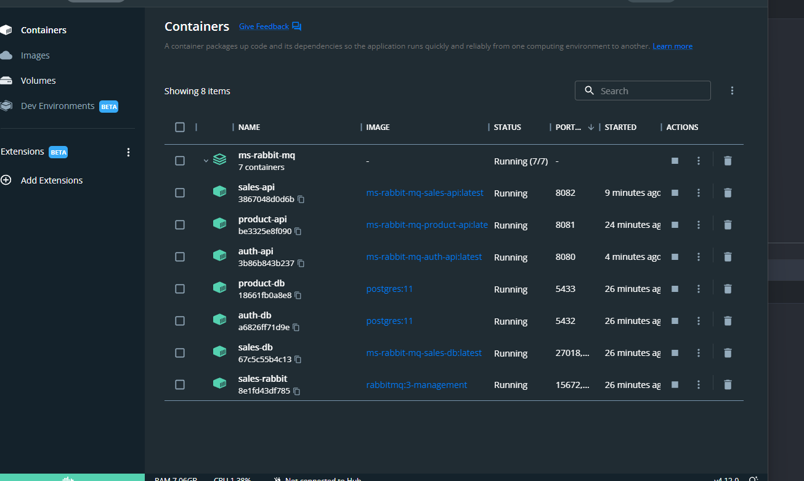

# Microservices with RabbitMQ and Docker

> **Status: Developing 🧑🏻‍💻**

## This project was created to better understand the architecture of microservices with message broker and containers.

### Some technologies used:

+ Java 
  + Maven 
  + Spring Boot
  + Lombok
  + OpenFeign
+ NodeJS
  + Typescript
  + Prisma
  + Express
  + TSX (Build)
  + Vitest
+ RabbitMQ
  + Topic
  + Exchange
  + Queue
+ Docker
  + Container creation (docker-compose)
  + Image creation (Dockerfile)
  + Communication between containers
+ PostgreSQL
+ MongoDB


## How to run the applications:

1) You need docker installed, for that follow the steps here [docker guide](https://docs.docker.com/engine/install/ubuntu/).
2) You need too docker compose, to run the settings more easily running the file YAML. To install follow the steps here [docker compose guide](https://docs.docker.com/compose/install/).
3) Run command "docker-compose up" in the root of the project.
4) Wait for the downloads and creation of images and containers.

## How to use application

- Authentication API expose in port 8080
  - POST: /api/auth/create
    ````json
      {
        "name": "string",
        "email": "string",
        "password": "string"
      }
      ````
  - POST: /api/auth/authenticate 
    ````json
      {
        "email": "string",
        "password": "string"
      }
      ````
- Product API expose in port 8081
- Sales API expose in port 8082
 

## Containers running
